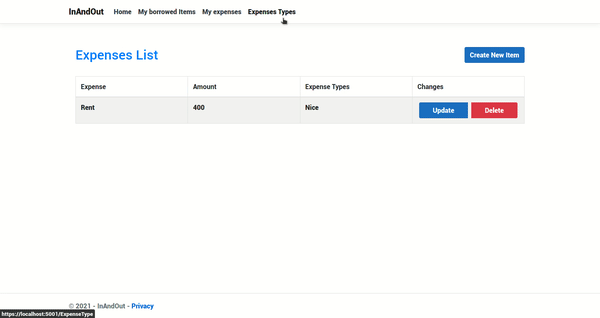

# InAndOut
This is a mvc core web application made using .net 5. 

.Net SDK version: 5.0.301

# Preview



# Database
The entity framework core was used to manage the database. To adjust the database the connection string in InAndOut.csproj must be modified for the database used. Entity framework can be installed to generate tables automatically:

Visual studio:

```
Add-Migration "name"
```

```
Update-database
```

Cli:

```
dotnet tool install --global dotnet ef
```

```
dotnet ef migrations add "name"
```

```
dotnet ef database update
```


# How to run
To run the application a .net runtime must be installed, it's available for all platforms. It can be runned using visual studio or via CLI in the extracted folder:

```dotnet run```
